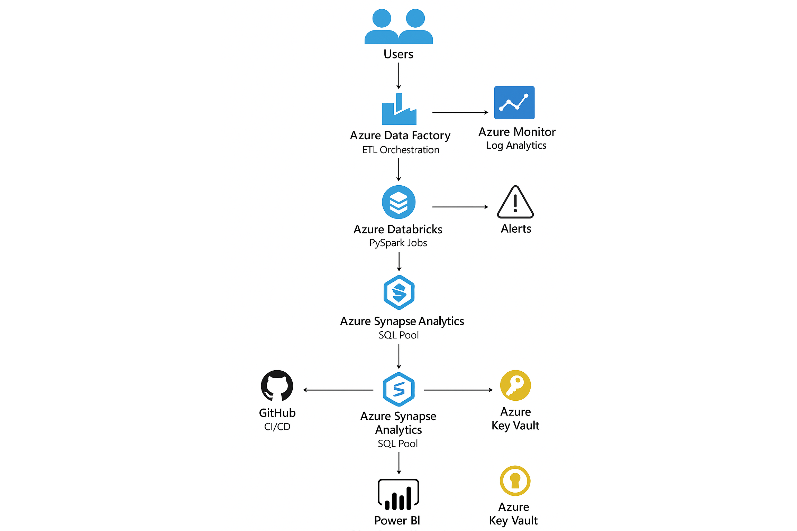

# Scalable Data Pipeline & Real-Time Analytics on Azure  

---

## 📌 Project Overview  

This project demonstrates an **enterprise-grade data engineering and analytics platform** built on **Azure Cloud**.  

It ingests raw CRM data, transforms it into curated datasets, loads into a **Synapse Data Warehouse**, and visualizes insights in **Power BI**. The project is designed to be **scalable, modular, and production-ready**, reflecting real-world Data & AI solutions.  

## Architecture Diagram

---

## 🧰 Tech Stack  

| Layer               | Tools / Tech Used                                         |
|----------------------|-----------------------------------------------------------|
| **Ingestion**        | Azure Data Factory (pipelines, triggers)                 |
| **Data Lake**        | Azure Data Lake Storage (Raw, Curated Zones)             |
| **Processing**       | Azure Databricks, PySpark (ETL & transformations)        |
| **Data Warehouse**   | Azure Synapse Analytics (SQL Pools, stored procedures)   |
| **Visualization**    | Power BI (Direct Query & Import modes)                   |
| **Orchestration**    | ADF pipelines & triggers                                 |
| **Source Control**   | Git & GitHub (with commits, versioning)                  |
| **DevOps**           | CI/CD concepts, YAML automation, Git workflows           |
| **Programming**      | Python (PySpark), SQL                                    |

---

## 🚀 Features  

- **Automated Data Ingestion** from CRM into Azure Data Lake (Raw Zone).  
- **Transformation Pipelines** in Databricks:  
  - Cleaning & handling null values  
  - Normalizing customer attributes  
  - Splitting `dob` into `day`, `month`, `year`  
  - Joining datasets for analytics  
- **Curated Zone Loading** into Synapse SQL tables.  
- **Analytics-Ready Warehouse** for BI dashboards.  
- **Power BI Dashboards** with:  
  - 📈 Customer Lifetime Value (CLV)  
  - 🔁 Retention & Churn Trends
 
 

## 🏗️ Project Structure  

``bash
crm-data-platform/
├── data_factory/          # ADF pipeline JSONs
├── databricks/            # PySpark notebooks (ETL transformations)
│   ├── transform.py
│   └── notebooks.ipynb
├── synapsanalytics/       # SQL scripts & schemas
│   ├── Transactions.sql
│   └── metrics.sql
├── powerbi/               # Power BI dashboards (.pbix)
├── diagrams/              # Architecture diagrams (draw.io, PNGs)
├── README.md              # Documentation
└── .gitignore

##📸 Screenshots
## 📸 Screenshots

## 🔥 Databricks

.png)
.png)
.png)

## 📊 Power BI Report

## ⚙️ How to Run the Project
1️⃣ Clone the Repository

git clone https://github.com/adharsh277/Scalable-Data-Pipeline-Real-Time-Analytics-on-Azure.git
cd Scalable-Data-Pipeline-Real-Time-Analytics-on-Azure
## 2️⃣ Set up Azure Resources
Create Azure Data Lake Storage Gen2 (with Raw, Curated containers).

Deploy Azure Data Factory (import pipeline JSONs).

Set up Azure Databricks Workspace.

Provision Azure Synapse SQL Pool.

Connect Power BI to Synapse.

## 3️⃣ Run ETL Pipelines
In ADF, trigger Ingestion pipeline → loads raw CRM files to Data Lake.

ADF triggers Databricks notebooks → PySpark jobs clean & transform.

Data is loaded to Synapse tables.

4️⃣ Visualize in Power BI
Open .pbix files from powerbi/.

Connect to Synapse SQL with either Direct Query or Import mode.

Explore dashboards & insights.

🔁 Example PySpark Transformation (Databricks)
python
Copy code
from pyspark.sql.functions import col, split

# Load CRM raw dataset
df = spark.read.option("header", True).csv("abfss://raw@datalake.dfs.core.windows.net/crm/customers.csv")

# Clean data (drop nulls)
df = df.na.drop()

# Split DOB into separate fields
df = df.withColumn("dob_day", split(col("dob"), "-")[2]) \
       .withColumn("dob_month", split(col("dob"), "-")[1]) \
       .withColumn("dob_year", split(col("dob"), "-")[0])

# Write to curated zone
df.write.mode("overwrite").parquet("abfss://curated@datalake.dfs.core.windows.net/crm/customers_cleaned")
📊 Example SQL (Synapse Analytics)
sql
Copy code
-- Transactions Table
CREATE TABLE dbo.Transactions (
    TransactionID INT PRIMARY KEY,
    CustomerID INT,
    Amount DECIMAL(10,2),
    TransactionDate DATE
);

-- Example Metric: Customer Lifetime Value
SELECT 
    CustomerID,
    SUM(Amount) AS LifetimeValue
FROM dbo.Transactions
GROUP BY CustomerID;
📈 Power BI Dashboard Highlights
CLV Analysis – Identify top customers by spend.

Churn Analysis – Customers at risk based on transaction inactivity.

Regional Insights – Sales by region, product categories.

Sales Funnel Conversion – Stage-wise customer journey visualization.

🙌 Learnings
Building end-to-end Azure Data Platforms.

Using PySpark for scalable transformations.

Designing star-schema models in Synapse.

Orchestrating pipelines with ADF.

Delivering business-ready insights in Power BI.

Applying DevOps practices in Data & AI.

##🙏 Acknowledgments
Thanks to Microsoft Azure, Databricks, and open-source PySpark libraries for enabling enterprise data solutions.

pgsql
Copy code

  - 🌍 Regional Behavior Analysis  
  - 📊 Sales Funnel Conversion  
- **Scalable & Modular** structure for enterprise adoption.  
